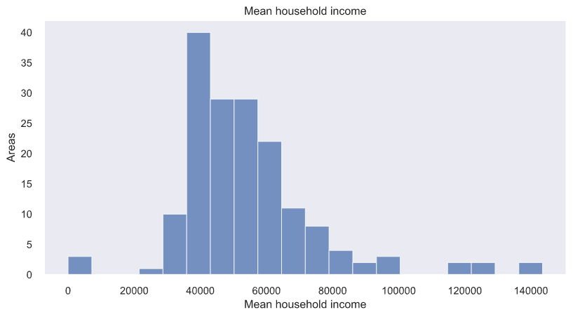

# Using data to decide where to open a new coffee shop in Helsinki region

## Introduction

Good Coffee Company Ltd has decided to expand to the Helsinki capital region. One question remains: Which neighborhood would be a good location for the new coffee shop?

To provide some basis for this decision, I analyzed data from the Helsinki capital region. I looked at the characteristics of the population in postal code areas, and also analysed the existing offering of cafés and restaurants in each postal code.

Helsinki capital region is an area which contains the cities of Vantaa, Espoo and Kauniainen, in addition to the capital of Finland: Helsinki. There are approximately 1.19 million inhabitants in the Helsinki capital region.

The aim of this study is to help the stakeholders of this imaginary coffee company to decide where to open a new cafe in the helsinki metropolitan region. The company does not previously have a cafe in Helsinki.

## Data

Data from several sources is combined for this analysis. The main data sources are the helsinki region infoshare site (hri.fi), and Foursquare places API (https://developer.foursquare.com/docs/places-api/).

### Map data

The map data about the postal areas was fetched from the helsinki region infoshare site: https://hri.fi/data/fi/dataset//paakaupunkiseudun-postinumeroalueet

The map data was downloaded in KML format and was converted to GeoJSON format using python package "kml2geojson". There are 168 postal code areas in the region, as shown in the following map. 

### Population end economics data

The main population data about the region was fetched from the statistics institute of Finland: https://pxnet2.stat.fi/PXWeb/pxweb/fi/Postinumeroalueittainen_avoin_tieto/Postinumeroalueittainen_avoin_tieto__2020/paavo_pxt_12f1.px/

The data looks like this, with one row for each postal code area, and many columns. Only small portion of the columns and rows are shown here.

One challenge is that the coordinate data about the postal code areas is in EUREF-FIN -format, as can be seen in the columns named "X-koordinaatti metreinä", and "Y-koordinaatti metreinä". This data has to be converted to the international WGS84 coordinate system so that it can be fed to the Foursquare API. For this conversion python package "pyproj" was used.

The population and economics data of the postal code areas is used to define what kind of population lives in the different areas, and what kind of buying power they have. We will also try to look into the amount of hotels and other hospitability businesses in the areas, hypothesis being that if there are hotels and other venues nearby maybe the customers would use the cafe as well.

### The venue data

For the venue data we will be using Foursquare API (https://developer.foursquare.com/docs/places-api/). The venue data will help to establish knowledge of the existing competition and other venues as well. To match the venue data to the postal code areas we would need the coordinates for the approximate center of each postal code. The method is approximate since only a distance from the "center" of the postal code area will be used, but I feel that it's good enough.

## Methodology 

I started with simple exploratory analysis to look at the distributions of the data, such as the inhabitant counts per postal code area:

The household income:

And the average population age:

### Finding the population properties of each postal code area

I used the K-means algorithm to group the region into clusters based on population and economics data, before doing that the data was analysed using the elbow method to find the optimal value of K. 

### Venue types of postal code areas

To group the postal code areas based on the venue types I also used k-means. At first I determined the optimal K value and then converted the category column into one-hot columns which can be used as the input in k-means.

To combine both the population data and venue data I simply intersected the two data sets.

## Analysis

### Properties of each postal code area, population and venue data

First I found out the optimal K for the k-means using the `KElbowVisualizer` from Yellowbrick library. The following results suggests that K = 7 would work the best, so this was used as the value.

The result of the clustering the population data with the cluster count K = 7:

Visualizing the clustering makes it easy to see how the clusters are formed.

Based on the analysis of the clusters they could be given names:

0. 'Low density, ManyChildren, Young'
1. 'LowIncome, Older, No University degrees'
2. 'Lowest income, No children, Youngest'
3. 'No population'
4. 'Low income, various other factors'
5. 'High income, University degrees, Low density'
6. 'Middle income, University degrees, High density'

It looks like cluster 6 could be a good choice for the location based on the properties of the population and economic statistics of the postal code areas.

I then plotted the cluster 6 areas on map and it looks like this, it seems there is one outlier on the western side of the map:

For the venue analysis I did similar K-means clustering. To start with the postal code data was combined with the venue category data as shown in the following table:

After this the venue categories were encoded into one-hot columns like this:

After feeding the onehot data to the clustering algorithm we can make the following plot. It shows the 9 venue category groups and the most common venue types for each category.

I also plotted the venue groups on the map to show the geographic distribution of the venues.

To get to the final result I wanted to find the intersection of the population and the venue data. I simply created a new dataframe which contained all the postal codes. After that I added both population group labels and the venue group labels. At this point the most desirable population cluster (cluster 6) and venue cluster (cluster 1) were selected. The resulting intersection of the population data cluster 6 and venue cluster 1 is shown on the following map:

## Results 

An interesting observation is that there was a strong correlation between certain types of venues and certain types of population, the population cluster 6 and venue cluster 1 matched each other for almost all postal codes.

## Discussion 

Based on the discussions with the owners of the Good coffee company it has been found that they would like to find a place with relatively high population density that would have good purchasing power and also an existing variety of food and hospitability related venues. This kind of analysis has at least the property that it makes the process more straightforward by providing smaller set of places to look at. 

## Conclusion 

There are some easy improvement possibilities. For example, since k-means tends to produce same sized clusters, it might be better to use some other clustering algorithm. It also might be interesting to look more closely into the correlation between population and venue types, does a population type correlate or even predict profitability of venues. Using dimensionality reduction (PCA) would help with visualising the features of the clusters.

More data might also help, as there are many other data sources which could be utilized in this kind of analysis. For example there is a lot of public transport data openly available for Helsinki region. If this was a real world case I have a feeling analysing the public transport data might be useful.

## References

[1] Helsinki region infoshare site (https://hri.fi/data/fi/dataset//paakaupunkiseudun-postinumeroalueet)
[2] Foursquare places API (https://developer.foursquare.com/docs/places-api/)
[3] Statistics Institute of Finland (https://pxnet2.stat.fi/PXWeb/pxweb/fi/Postinumeroalueittainen_avoin_tieto/)