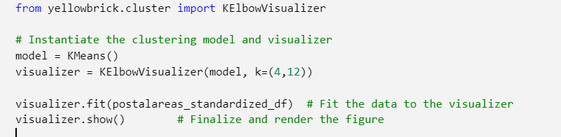

# Using data to decide where to open a new coffee shop

## Introduction

Good Coffee Company Ltd has decided to expand to the Helsinki capital region. One question remains: Which neighborhood would be a good location for the new coffee shop?

To provide some basis for this decision, I analyzed data about the Helsinki capital region. I looked at the characteristics of the postal code areas, and also analysed the existing offering of cafés and restaurants in the area.

Helsinki capital region is an area which contains the cities of Vantaa, Espoo and Kauniainen, in addition to the capital of Finland: Helsinki. There are approximately 1.19 million inhabitants in the Helsinki capital region.

The aim of this study is to help the stakeholders of this imaginary coffee company to decide where to open a new cafe in the helsinki metropolitan region. The company does not previously have a cafe in Helsinki.

## Data

Data from several sources is combined for this analysis. The main data sources are the helsinki region infoshare site (hri.fi), and Foursquare places API (https://developer.foursquare.com/docs/places-api/).

### Map data
The map data about the postal areas can be fetched from here: https://hri.fi/data/fi/dataset//paakaupunkiseudun-postinumeroalueet

The map data was in KML format and was converted to GeoJSON format using python package "kml2geojson".

There are 168 postal code areas in the region, as shown in the following map. 

### Economics data

The main economics data about the region can be fetched from here.

https://pxnet2.stat.fi/PXWeb/pxweb/fi/Postinumeroalueittainen_avoin_tieto/Postinumeroalueittainen_avoin_tieto__2020/paavo_pxt_12f1.px/

The data looks like this, with 168 rows and many columns, only small portion of the columns and rows are shown here.

One challenge is that the coordinate data about the postal code areas is in EUREF-FIN -format, as can be seen in the columns named "X-koordinaatti metreinä", and "Y-koordinaatti metreinä". This data has to be converted to the international WGS84 coordinate system so that it can be fed to the Foursquare API. For this conversion python package "pyproj" was used.

We will use the economics data to clearly define what kind of population lives in the different areas, and what kind of buying power they have. We will also try to look into the amount of hotels and other hospitability businesses in the areas, hypothesis being that if there are hotels and other venues nearby maybe the customers would use the cafe as well.

### The venue data

For the venue data we will be using Foursquare API (https://developer.foursquare.com/docs/places-api/). The venue data will help to establish knowledge of the existing competition and other venues as well. To match the venue data to the postal code areas we would need the coordinates for the approximate center of each postal code.

## Methodology 

section which represents the main component of the report where you discuss and describe any exploratory data analysis that you did, any inferential statistical testing that you performed, if any, and what 
machine learnings were used and why.

I started with simple exploratory analysis to look at the distributions of the data. I looked at the inhabitant counts per postal code area:

And I looked at the household income:

### Finding the properties of each postal code area

I used the K-means algorithm to group the region into clusters based on population and economics data, before doing that the data was analysed using the elbow method to find the optimal value of K. The following results suggests that K = 7 would work the best, so this was used as the value.

From the clustering results it can be seen that there is indeed separate types of areas in the region.

Based on the analysis of the clusters they could be given names:

0. 'Low density, ManyChildren, Young'
1. 'LowIncome, Older, No University degrees'
2. 'Lowest income, No children'
3. 'No population'
4. 'Low income, various other factors'
5. 'High income, University degrees, Low density'
6. 'Middle income, University degrees, High density'

It looks like cluster 6 could be a good choice for the location based on the properties of the population and economic statistics of the postal code areas.

## Analysis

## Results 

section where you discuss the results.

From the results it can be seem There are clearly different types of areas in the Helsinki capital region, some areas are relatively sparsely populated.

## Discussion 

section where you discuss any observations you noted and any recommendations you can make based on the results.

## Conclusion 

section where you conclude the report.

It would be easy to try different clustering algorithms, maybe that would be one area for futher improvement.

